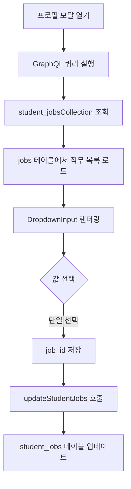
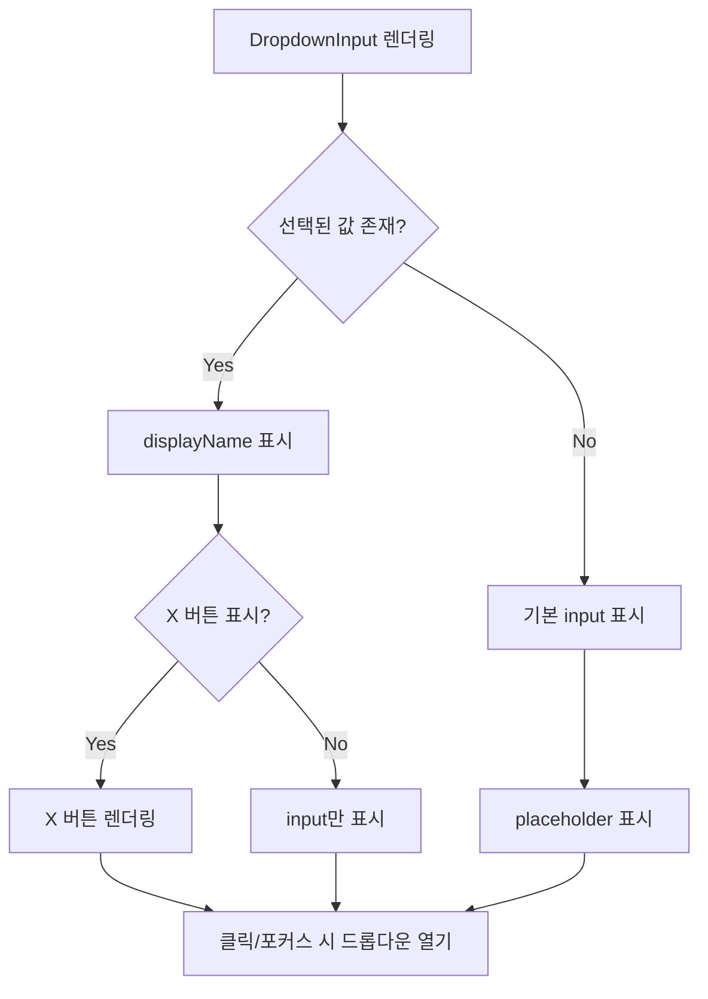

# [I25-300] 프로필 모달에 희망직무 선택 기능 추가

## 💡 개요

프로필 모달에 희망직무 선택 기능을 추가하여 사용자가 직무를 선택하고 저장할 수 있도록 구현했습니다. 단일 선택 드롭다운으로 `jobs` 테이블의 직무를 선택하며, `student_jobs` 관계 테이블에 저장됩니다.

또한 `DropdownInput` 컴포넌트를 리팩토링하여 커스텀 div 대신 기본 input 구조를 재사용하도록 개선하고, 복수 선택 드롭다운에서도 X 버튼 표시 및 클릭 시 드롭다운이 열리도록 기능을 개선했습니다.

## 📃 작업내용

### 1. 희망직무 필드 추가

프로필 모달에 단일 선택 드롭다운으로 희망직무를 선택할 수 있는 필드를 추가했습니다.

### 2. DropdownInput 컴포넌트 리팩토링

커스텀 div를 제거하고 기본 input 구조를 재사용하도록 통일했습니다.

### 3. 주요 구현 내용

1. **클라이언트 jobs 조회 함수 생성** (`getJobs.client.ts`)
   - 클라이언트에서 `jobs` 테이블 데이터를 조회하는 함수 추가

2. **student_jobs 업데이트 핸들러** (`relationTableHelper.graphql.ts`)
   - `updateStudentJobs` 함수 구현
   - 단일 선택 처리: upsert 방식으로 변경 (기존 레코드가 있으면 job_id 업데이트, 없으면 insert)
   - 프로필 생성 및 업데이트 시 모두 upsert 방식 사용

3. **profileConfig 업데이트**
   - GraphQL read 쿼리에 `student_jobsCollection` 추가
   - `dropdownInputList` 타입의 희망직무 필드 추가
   - `onlyOne: true`로 단일 선택 설정

4. **프로필 생성 시 희망직무 저장 로직 추가** (`saveProfile.client.ts`)
   - `ProfileSaveData` 인터페이스에 `studentJobs: number[]` 필드 추가
   - `transformFormDataToSaveFormat`에서 `student_jobs` 필드 처리 (job_id 추출)
   - `saveProfileData`에서 `student_jobs`를 upsert 방식으로 저장
   - 프로필 생성 시에도 희망직무가 저장되도록 개선

5. **DropdownInput 리팩토링**
   - 커스텀 div 제거, 기본 input 구조 사용
   - `onlyOne: true/false` 모두 동일한 구조 사용
   - 선택된 값이 있으면 displayName 표시 및 X 버튼 표시
   - 클릭/포커스 시 드롭다운 자동 열기

6. **복수 드롭다운 개선**
   - `onlyOne: false`일 때도 X 버튼 표시
   - X 버튼 클릭 시 삭제 후 드롭다운 자동 열기
   - input 클릭/포커스 시 드롭다운 열기

## 🔀 변경사항

### 추가 개선사항

1. **복수 드롭다운 UX 개선**
   - 프로젝트 기여자 필드에서 UUID 대신 displayName 표시
   - X 버튼 클릭 시 드롭다운 자동 열기 기능 추가
   - input 클릭 시 드롭다운이 열리도록 개선

2. **DropdownInput 컴포넌트 통일**
   - `onlyOne: true/false` 모두 동일한 input 구조 사용
   - 커스텀 div 제거로 코드 간결화 및 유지보수성 향상

3. **데이터 변환 로직 개선**
   - `processRestRelationTables`에 `student_jobs` 케이스 추가
   - `handleInputFocus`에서 복수 드롭다운도 지원하도록 개선

4. **저장 방식 개선**
   - `updateStudentJobs` 함수를 delete + insert에서 upsert 방식으로 변경
   - 프로필 생성 및 업데이트 시 모두 upsert 방식 사용으로 일관성 향상

## 주요 파일 변경

- `src/services/portfolio/getJobs.client.ts` (신규)
- `src/services/graphQL/relationTableHelper.graphql.ts`
- `src/services/config/profileConfig.ts`
- `src/services/profile/saveProfile.client.ts`
- `src/app/components/ui/input/DropdownInput.tsx`
- `src/app/components/modal/inputs/InputListProvider.tsx`

