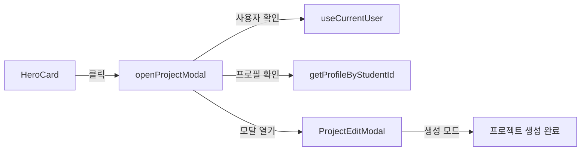
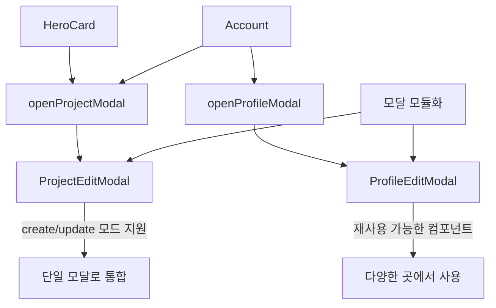
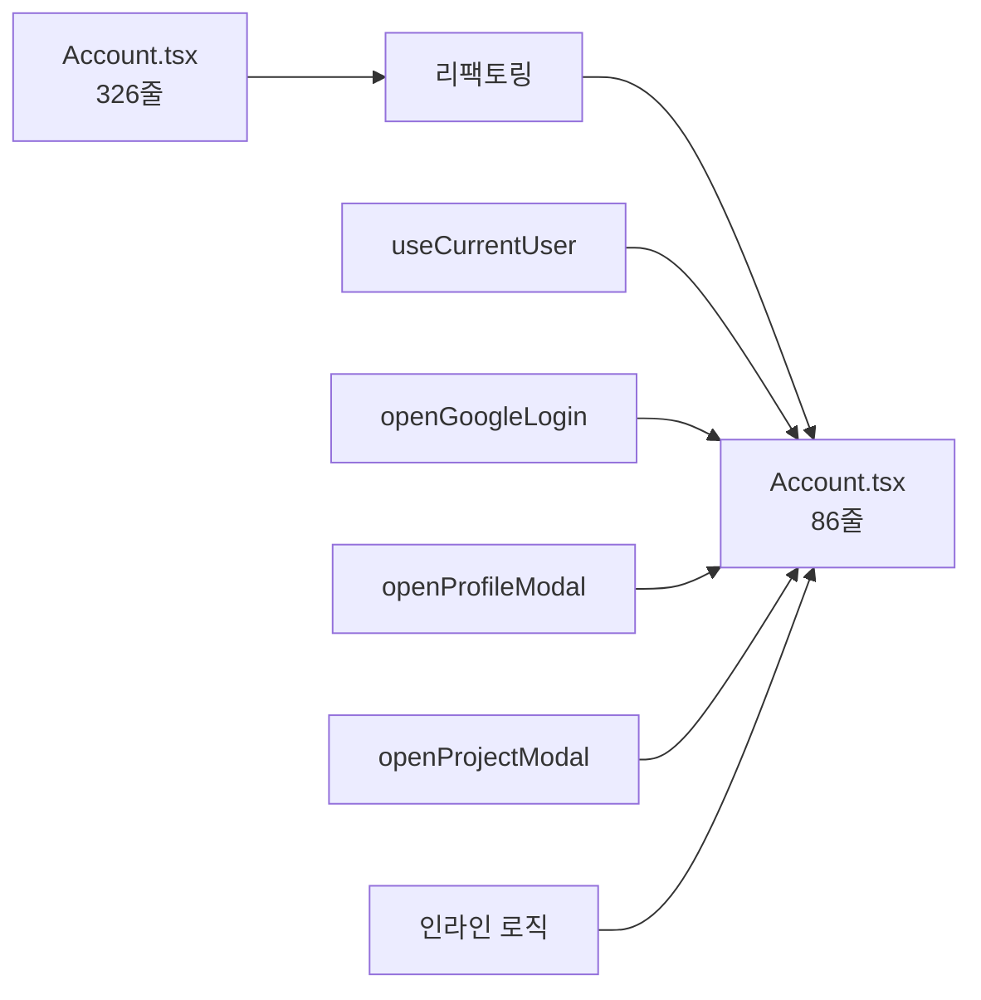
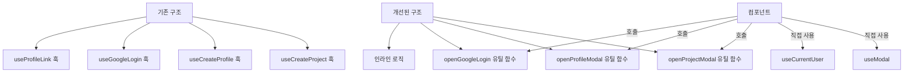

# Pull Request

## 💡 개요
HeroCard 컴포넌트의 "프로젝트 올리기" 버튼 클릭 시 프로젝트 추가 모달이 열리도록 기능을 추가하고, 모달 관련 코드를 모듈화하여 재사용성을 높였습니다. 또한 Account 컴포넌트를 리팩토링하여 코드 분량을 약 75% 감소시켰으며, 모달 생성 로직을 훅에서 유틸리티 함수로 리팩토링하여 불필요한 추상화를 제거하고 컴포넌트에서 직접 제어할 수 있도록 개선했습니다.

## 📃 작업내용

### 1. HeroCard 프로젝트 추가 모달 연동
HeroCard의 "프로젝트 올리기" 버튼을 클릭하면 프로젝트 생성 모달이 열리도록 구현했습니다.

### 2. 모달 모듈화 및 통합
인라인으로 정의된 모달 컴포넌트들을 별도 파일로 분리하고, 중복된 모달을 통합했습니다.

### 3. Account 컴포넌트 리팩토링 및 최적화
복잡한 로직을 커스텀 훅과 유틸 함수로 분리하고, 불필요한 추상화를 제거하여 코드를 간소화했습니다.

### 4. 모달 생성 로직을 훅에서 유틸 함수로 리팩토링
불필요한 추상화를 제거하고 컴포넌트에서 직접 모달 로직을 제어할 수 있도록 개선했습니다.

## 🔀 변경사항

### 추가 작업
- **모달 모듈화**: ProjectCreateModal을 ProjectEditModal로 통합하여 중복 코드 제거
- **커스텀 훅 생성**: 
  - `useCurrentUser`: 사용자 인증 상태 관리
- **유틸리티 함수 생성**:
  - `openProjectModal`: 프로젝트 생성 모달 열기 로직
  - `openProfileModal`: 프로필 생성/수정 모달 열기 로직
  - `openGoogleLogin`: Google 로그인 팝업 로직
- **Account 컴포넌트 최적화**: 코드 분량 74% 감소 (326줄 → 86줄)
  - `useProfileLink` 훅을 인라인 로직으로 변경
  - 두 개의 `useEffect`를 하나로 통합
  - `useCallback` 제거 및 인라인 함수로 변경
  - `Promise.all`을 사용한 병렬 처리로 성능 개선
- **에러 메시지 처리 유틸리티**: `formatErrorMessage` 함수로 에러 메시지 포맷팅 로직 중복 제거

### 개선 사항
- 불필요한 추상화 제거: 모달 생성 로직을 훅에서 유틸 함수로 변경하여 컴포넌트에서 직접 제어 가능
- 단일 사용 훅 인라인화: `useProfileLink`처럼 한 곳에서만 사용되는 훅을 컴포넌트 내부 로직으로 통합
- 불필요한 프로필 이름 추출 로직 제거 (기존 useEffect가 자동으로 처리)
- 모달 컴포넌트의 재사용성 향상
- 코드 중복 제거 및 관심사 분리
- 컴포넌트에서 모달 로직을 직접 확인할 수 있어 가독성 향상
- 성능 최적화: API 호출을 병렬 처리하여 초기 로딩 시간 단축
