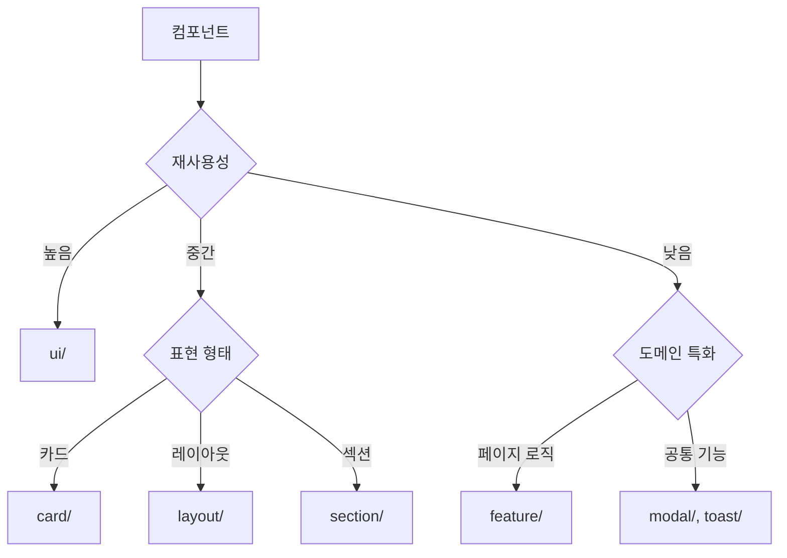

# Components 구조

이 디렉토리는 애플리케이션의 모든 React 컴포넌트를 포함합니다.

## 폴더 구조

```
components/
├── ui/                 # 재사용 가능한 기본 UI 컴포넌트
├── card/               # 도메인별 카드 컴포넌트
├── layout/             # 기능별 레이아웃 컴포넌트
├── section/            # 도메인별 섹션 컴포넌트
├── feature/            # 도메인별 기능 특화 컴포넌트
├── modal/              # 모달 컴포넌트
└── toast/              # 토스트 알림 컴포넌트
```

## 폴더별 설명

### 📦 ui/
**목적**: 재사용성이 높은 순수 UI 컴포넌트
**특징**: 비즈니스 로직 없음, 다양한 도메인에서 사용 가능

```
ui/
├── badge/          # Badge, StatusBadge
├── button/         # Button, EditButton, RoundedButton
├── dropdown/       # Dropdown
├── input/          # 모든 input 컴포넌트 + types
├── label/          # InputLabel, TeamLabel
├── tag/            # CategoryTag, DepartmentTag, SkillTag
├── text/           # text 컴포넌트 + text.css
└── profile/        # ProfileImage, ProfileIcon
```

### 🎴 card/
**목적**: 특정 데이터를 카드 형태로 표시
**특징**: 도메인별로 분류, 재사용 가능

```
card/
├── contest/        # ContestCard
├── home/           # AutoCarousel, BusinessCard
├── portfolio/      # PortfolioCard, ProfileEditButton 등
└── project/        # ProjectCard, ProjectAddCard
```

### 📐 layout/
**목적**: 페이지 레이아웃 구성 요소
**특징**: 기능별로 분류 (header, footer, sidebar, tabs)

```
layout/
├── header/         # Header, HeaderDropdown, Navigator
├── footer/         # Footer
├── sidebar/        # SidebarLayout, SidebarContentLayout
└── tabs/           # Tabs
```

### 📑 section/
**목적**: 페이지 내 섹션 단위 컴포넌트
**특징**: 도메인별로 분류, 여러 UI 컴포넌트 조합

```
section/
└── project/        # Project*Section (5개 섹션)
```

### ⚙️ feature/
**목적**: 페이지 레벨 또는 도메인 특화 컴포넌트
**특징**: 비즈니스 로직 포함, 도메인별로 강하게 결합

```
feature/
├── auth/           # 인증 관련 (Account, LoginBox 등)
├── collect/        # 검색/필터링 (CollectClient)
├── home/           # 홈 페이지 전용
├── portfolio/      # 포트폴리오 전용
├── project/        # 프로젝트 페이지 및 사이드바
└── team/           # 팀 페이지 및 사이드바
```

각 feature 폴더에는 별도의 README.md가 있습니다.

### 🔔 modal/ & toast/
**목적**: 전역 UI 컴포넌트
**특징**: 애플리케이션 전체에서 사용되는 공통 기능

- **modal/**: 모달 컴포넌트 및 Context, inputs 관련
- **toast/**: 토스트 알림 컴포넌트 및 Context

## 컴포넌트 분류 기준

### 재사용성에 따른 분류



### 어느 폴더에 배치할까?

1. **비즈니스 로직이 없는 순수 UI?** → `ui/`
2. **카드 형태의 UI?** → `card/`
3. **페이지 레이아웃 구성?** → `layout/`
4. **페이지 내 섹션?** → `section/`
5. **특정 도메인에 강하게 결합?** → `feature/`
6. **전역 기능?** → `modal/` 또는 `toast/`

## Import 규칙

- **절대 경로 사용**: `@/app/components/...`
- **타입 export**: 필요한 경우 타입도 함께 export
- **barrel exports**: 각 폴더에 index.ts 사용 가능 (선택사항)

## 예시

```typescript
// ✅ Good: 절대 경로
import Button from '@/app/components/ui/button/Button';
import ProfileImage from '@/app/components/ui/profile/ProfileImage';
import ProjectCard from '@/app/components/card/project/ProjectCard';

// ❌ Avoid: 상대 경로 (같은 폴더 내에서만 허용)
import Button from '../../../ui/button/Button';
```

## 주의사항

1. **순환 참조 방지**: feature → ui는 가능, ui → feature는 불가
2. **명확한 책임**: 한 컴포넌트는 한 가지 역할만
3. **적절한 분류**: 재사용성과 도메인 결합도를 고려하여 배치

## 기여하기

새로운 컴포넌트를 추가할 때는:
1. 적절한 폴더 선택 (위의 분류 기준 참고)
2. 명확한 이름 사용
3. 필요한 경우 README 업데이트
4. 타입 정의 포함
5. 절대 경로로 import
